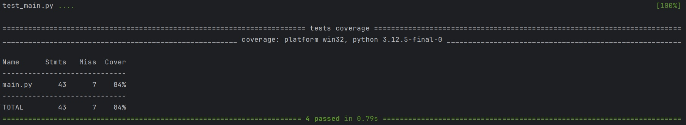
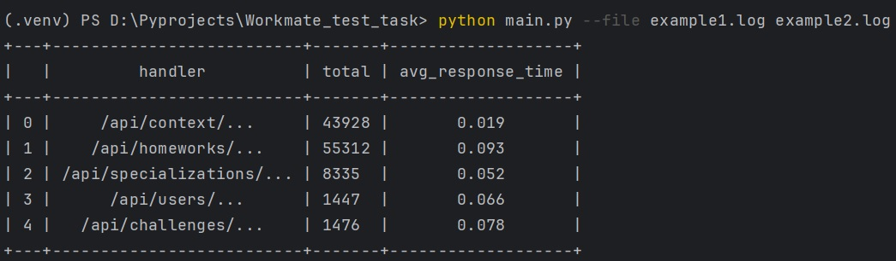
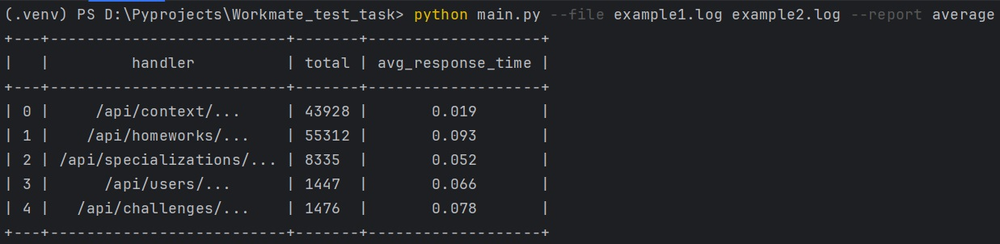
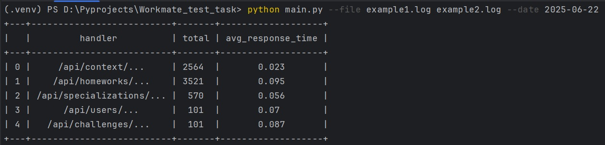

## Описание

Проект представляет собой простой парсер логов, который анализирует JSON-файлы с логами, чтобы сформировать отчет о том, сколько раз обращались к каждому URL и показывает среднее время ответа. Результат можно вывести в консоль или сохранить в файл.

## Установка

1. Клонируйте репозиторий:
```bash
git clone https://github.com/Twydir1762/parser_task.git
```

2. Перейдите в директорию проекта:
```bash
cd Workmate_test_task
```

3. Установите зависимости:
```bash
pip install -r requirements.txt
```

## Использование

Синтаксис:
```bash
python main.py --file <путь_к_файлу(ам)_лога> [--report <имя_отчёта>] [--date <дата_для_фильтрации>]
```

### Примеры использования:

1. Анализ лога и вывод отчёта в терминал:
```bash
python main.py --file logs.json
```

2. Анализ нескольких логов и сохранение отчёта в файл:
```bash
python main.py --file logs1.json logs2.json --report average
```
В результате выполнения отчёт будет выведен в терминал и создастся файл average.txt

3. Фильтрация по дате:
```bash
python main.py --file logs1.json logs2.json --date 2025-06-22
```
В результате выполнения будут проанализированы только те логи, дата которых совпадает с введенной

Параметры:
- `--file` (обязательный): Путь к одному или нескольким лог-файлам для анализа.
- `--report` (необязательный): Имя файла для сохранения отчета. Если не указано, отчет будет выведен только в консоль.
- `--date` (необязательный): Фильтрация по дате в формате `YYYY-MM-DD`. 

Пример вывода:
```
+---+-------------------------+-------+-------------------+
|   |         handler         | total | avg_response_time |
+---+-------------------------+-------+-------------------+
| 0 |    /api/context/...     |  10   |       0.24        |
| 1 |   /api/homeworks/...    |  20   |       0.11        |
| 2 | /api/specialization/... |  10   |        0.4        |
+---+-------------------------+-------+-------------------+
```

## Тестирование

Для тестирования проекта используется `pytest`. Для запуска тестов введите команду:
```bash
pytest -v
```

Тесты покрывают следующие аспекты:

- Корректная работа парсера логов.
- Формирование отчета с правильными данными.
- Формирование отчёта с фильтрацией даты
- Обработка ошибок при неверных путях к файлам и неправильных параметрах.

Покрытие файла main.py тестами:



## Примеры запуска проекта

Для файлов example1.log и example2.log (включены в репозиторий):

1. Простой вывод отчёта в консоль:



2. Вывод отчёта в консоль, сохранение отчёта в файл average.txt:



3. Вывод отчёта в консоль, фильтрация по дате `2025-06-22`:


